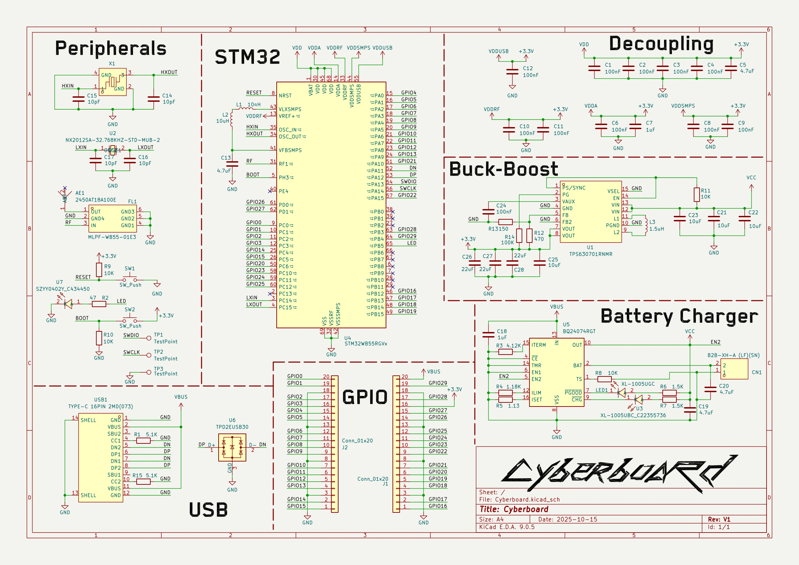
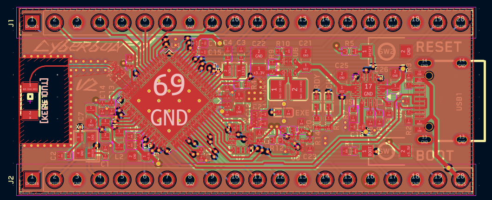
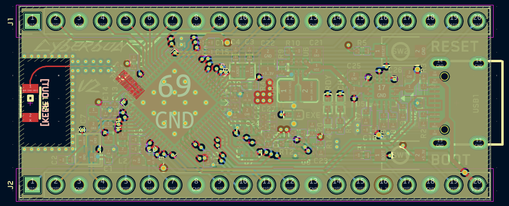
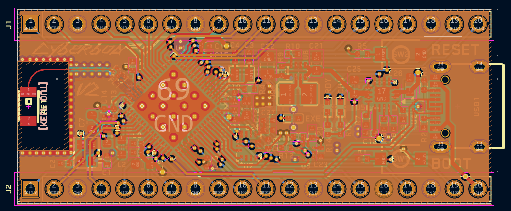
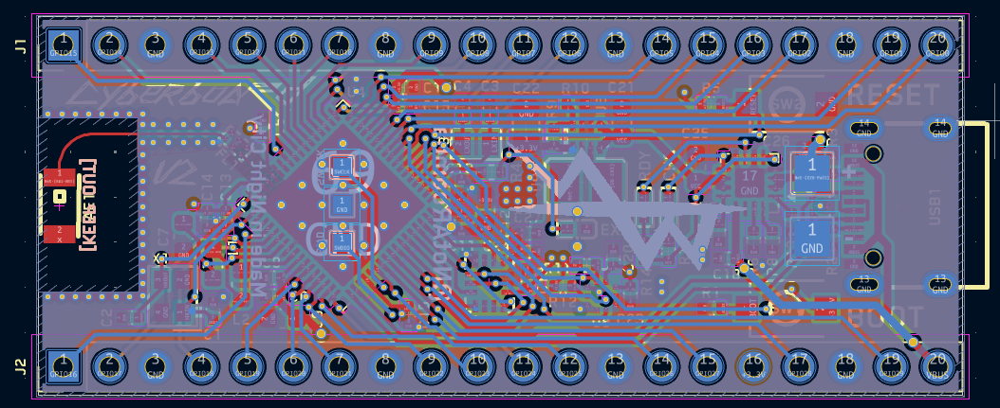
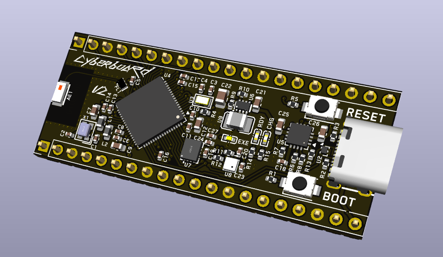
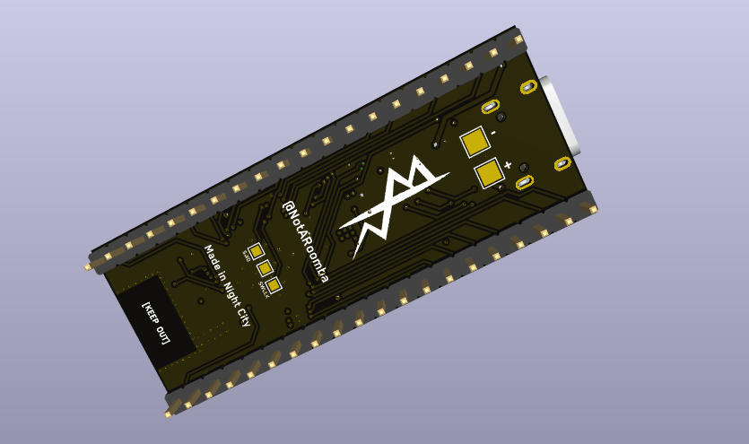
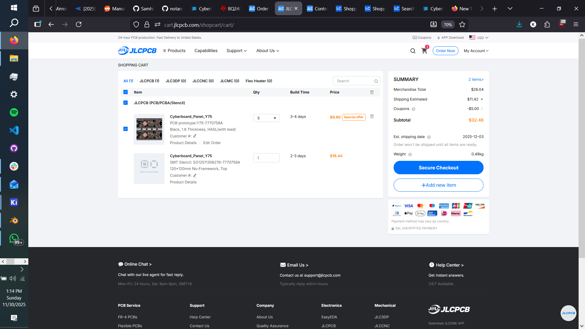

<h1 align="center">
   
  
   
  Cyberboard V2
   
</h1>

<h4 align="center">
A Raspberry Pi Pico-sized STM32 development board with Bluetooth, battery support, IMU and a barometer!
</h4>

  <a href="#key-features">Key Features</a> •
  <a href="#pcb">PCB</a> •
  <a href="#credits">Credits</a> •
  <a href="#license">License</a>

## Key Features

- **STM32WB55CG** microcontroller with Bluetooth support
- **Raspberry Pi Pico form factor** for compatibility
- **IMU and Barometer** - ICM-42688 (6-axis) and BMP580 pressure sensor for environmental/motion sensing
- **Battery charging** with BQ24072RGTR IC and JST connector for 1S LiPo
- **Buck-Boost converter** (TPS631000) for efficient power management
- **Multiple Status LEDs** for visual feedback
- **USB-C** connectivity
- **Ceramic Bluetooth antenna** with impedance matching
- **SWD test points** on the bottom for easy programming
- **4-layer PCB** design with optimized RF layout and routing
- **Panelized design** for cost-effective manufacturing

## PCB

Designed in KiCad with attention to RF design, power management, and sensor integration. The board features a 4-layer stackup (SIG/GND/PWR/SIG) with optimized routing for the Bluetooth antenna and sensitive analog signals.

### Features

- Efficient antenna routing with impedance matching
- Optimized sensor placement (IMU and Barometer) away from RF components
- SPI interface for IMU (ICM-42688) and I2C interface for Barometer (BMP580)
- Improved power delivery with optimized buck-boost converter

### Schematic

### PCB Layers

The 4-layer stackup (SIG/GND/PWR/SIG) provides optimal signal integrity and power distribution:

**Layer 1 (Signal):**

**Layer 2 (Ground):**

**Layer 3 (Power):**

**Layer 4 (Signal):**

**Front:**

**Back:**

### JLCPCB Order

## Credits

This project uses:

- [KiCad](https://www.kicad.org/)
- [Blender](https://www.blender.org/) for 3D renders
- [Hack Club Blueprint](https://blueprint.hackclub.com/projects/491)

## You may also like...

- [CyberCard](https://github.com/NotARoomba/CyberCard) – A Cyberpunk themed NFC hacker card
- [Niveles De Niveles](https://github.com/NotARoomba/NivelesDeNiveles) – Real-time flood alert app
- [Linea](https://github.com/NotARoomba/Linea) – An EMR tablet
- [Tamaki](https://github.com/NotARoomba/Tamaki) – A cute HackPad

## License

MIT

---

> [notaroomba.dev](https://notaroomba.dev) &nbsp;&middot;&nbsp;
> GitHub [@NotARoomba](https://github.com/NotARoomba) &nbsp;&middot;&nbsp;
