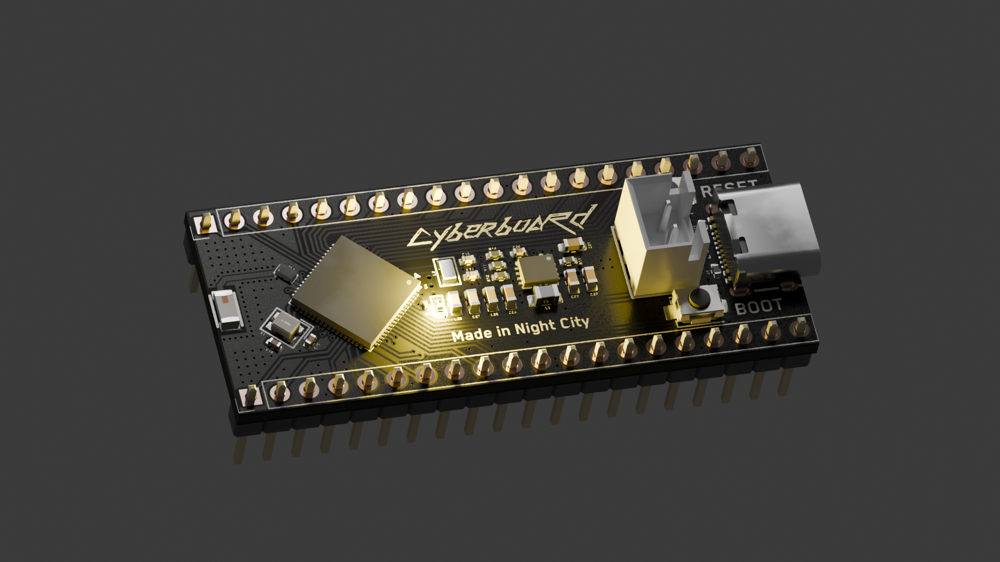
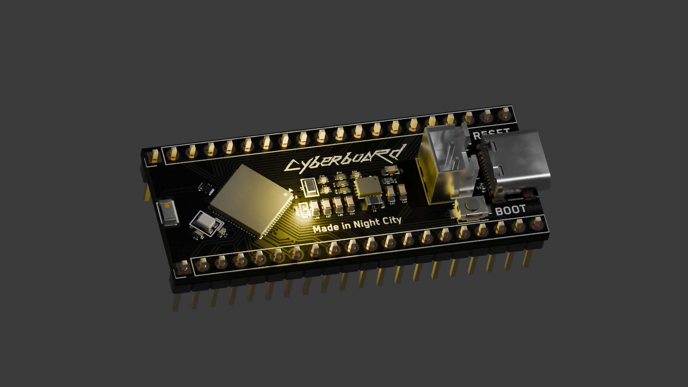
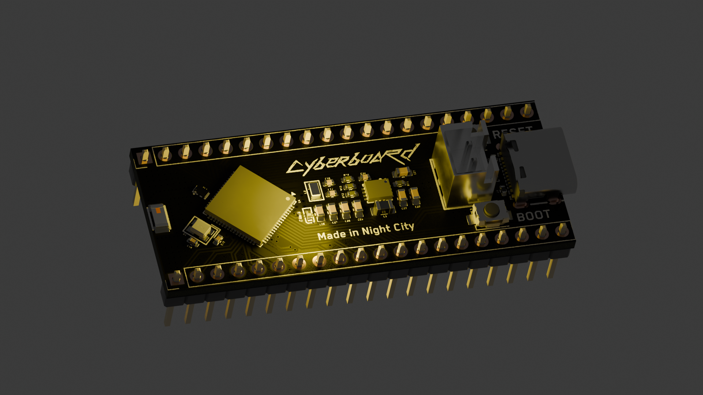

<h1 align="center">
   
  
   
  Cyberboard
   
</h1>

<h4 align="center">
A Raspberry Pi Pico-sized STM32 development board with Bluetooth and battery support! Now with more features!
</h4>

  <a href="#key-features">Key Features</a> •
  <a href="#pcb">PCB</a> •
  <a href="#credits">Credits</a> •
  <a href="#license">License</a>

## Key Features

- **STM32WB55CG** microcontroller with Bluetooth support
- **Raspberry Pi Pico form factor** for compatibility
- **Battery charging** with BQ24074 IC and JST connector for 1S LiPo
- **Buck-Boost converter** (TPS630701RNMR) for efficient power management
- **LED** for visual feedback
- **USB-C** connectivity
- **Ceramic Bluetooth antenna** with impedance matching
- **SWD test points** on the bottom for easy programming

## PCB

Designed in KiCad with attention to RF design and power management.

### Schematic

### PCB Layout

**Front:**

**Back:**

### JLCPCB Order

### 3D Renders (Old Layout)

## Credits

This project uses:

- [KiCad](https://www.kicad.org/)
- [Blender](https://www.blender.org/) for 3D renders
- [Hack Club Blueprint](https://blueprint.hackclub.com/projects/491)

## You may also like...

- [CyberCard](https://github.com/NotARoomba/CyberCard) – A Cyberpunk themed NFC hacker card
- [Niveles De Niveles](https://github.com/NotARoomba/NivelesDeNiveles) – Real-time flood alert app
- [Linea](https://github.com/NotARoomba/Linea) – An EMR tablet
- [Tamaki](https://github.com/NotARoomba/Tamaki) – A cute HackPad

## License

MIT

---

> [notaroomba.dev](https://notaroomba.dev) &nbsp;&middot;&nbsp;
> GitHub [@NotARoomba](https://github.com/NotARoomba) &nbsp;&middot;&nbsp;
